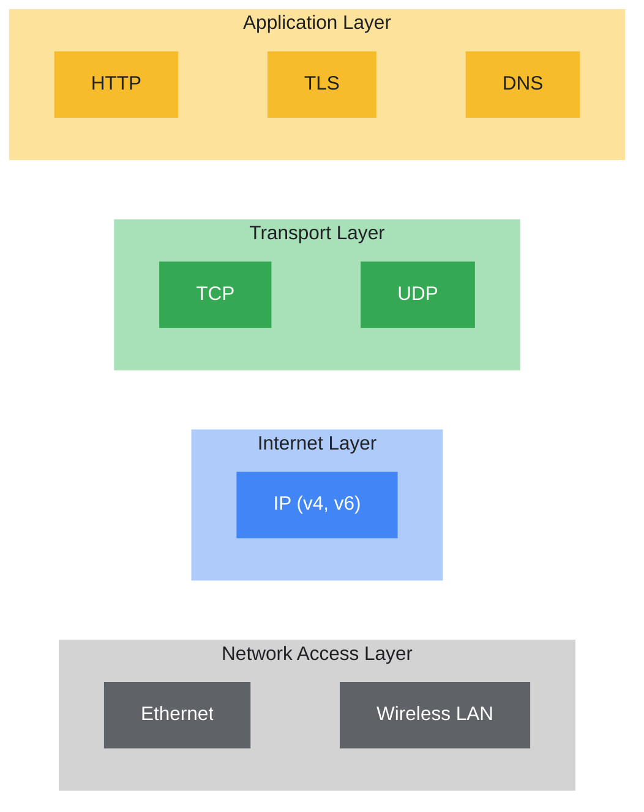
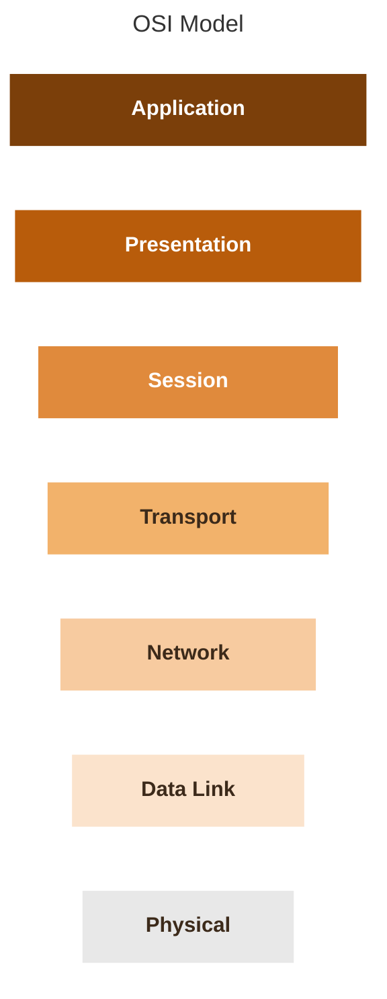

# Course 3: Connect and Protect: Networks and Network Security
Learning Outcomes:
- Network Architecture
- Operations Intrusion Tactics
- Common types of Network Vulnerabilities & Attacks
- How to Secure Networks
- Common Network Protocols
- Firewalls
- Virtual Private Network
- System Hardening Practices

# Module 1: Network Architecture
*You'll be introduced to network security and explain how it relates to ongoing security and vulnerabilities. You will learn about network architecture and mechanisms to secure a network.*

`Network` is a group of connected devices.

`(LAN) Local Area Network` is a network that spans a small area like an office building.

`(WAN) Wide Area Network` is a network that spans a large geographic area like a city, state, or country.

`Offensive Security Engineer` - simulates adversaries and threats that are targeting various companies.

`Network Traffic Analysis` is  looking at network across various application and network layers.

### Network Tools

`Hub` is a network device that broadcasts infromation to every device on the network.

`Switch` is a device that makes connections between specific devices on a network by sending and receiving data between them. *(More intelligent than a hub)*

`Router` is a network device that connects **multiple networks** together.

`Modem` is a device that connects your router to the internet and brings internet access to the LAN.

`Virtualization tools` are pieces of software that perform network operations.

After establishing a connection to the network, devices send `data packets`. The data packets provide information about the source and the destination of data.

### Cloud Networks

`Cloud Computing` -- The practice of using remote servers, applications, and network services that are hosted on the internet instead of on local physical devices.

`Cloud Network` -- A collection of servers or computers that stores resources and data in remote data centers that can be accessed via the innternet.

### Computing Processes in the Cloud
A Cloud Service Provider is a company that offers cloud computing services.

CSP's provide three main categories of service:
- `Software as a service (SaaS)` refers to software suites operated by the CSP that a company can use remotely without hosting the software.
- `Infrastructure as a service (Iaas)` refers to the use of virtual computer components offered by the CSP.
    + Virtual containers and storage
- `Platform as a service (PaaS)` refers to tools that application developers can use to design custom applications for their company.

## Network Communication

**`Data Packet`** - A basic unit of information that travels from one device to another within a network.
Structure below:

| **Header**                                     | Body           | Footer |
|------------------------------------------------|----------------|--------|
| IP address / MAC address / Protocol Number     |   The message that needs to be transmitted |  Signals to receiving device that packet has finished      |

How well packets move across the network can be a way to see the health of a network. `Bandwidth` is the amount of data a device recieves every second.
$$
\text{Bandwidth} = \frac{\text{Quantity of Data}}{\text{Time (s)}}
$$

`Speed` is the rate at which data packets are recieved or downloaded.

`Packet Sniffing` is the practice of capturing and inspecting data packets across a network.

### The TCP/IP Model

#### Transmission Control Protocol (TCP)
An internet communication protocol that allows two devices to form a connection and stream data. The protcol includes a set of **instructions to organize data**, so it can be sent across a network. It also **establishes a connection** between two devices and makes sure the packet reaches the appropriate destination.

#### Internet Protocol (IP)
A set of standards used for routing and addressing data packets as they travel between devices on a network. Included is the **IP Address** that functions as an address for each private network.

When data is sent and recieved across a network, they are assigned a port.

A `Port` is a software-based location that organizes the sending and recieving of data between devices on a network.

##### Common Port Numbers:
- Port **25** - Email
- Port **443** - Secure Internet Communication
- Port **20** - Large File Transfers

### The Four Layers of the TCP/IP Model
The model is a framework used to visualize how data is organized and transmitted acorss the network.

`Network Access Layer` - This layer (sometimes called the `Data Link Layer`) deals with **creation of data packets** and their transmission across a network. Includes **hardware devices connected to physical cables and switches** that direct data to it's destination.

`Internet Layer` - This layer is where IP addresses are attached to data packets to indicate the **location of sender and receiver**. Also focuses on how networks connect to each other.

Common protocols that operate on internet layer:
- **Internet Protocol (IP)** - sends the data packets to the correct destination and relies on the Transmission Control Protocol/User Datagram Protocol (TCP/UDP) to deliver them to corresponding service.
- **Internet Control Message Protocol (ICMP)** - Shares error information amd status updates of data packets. Useful for detecting and troubleshooting network errors.

`Transport Layer` - This layer includes protcols to **control the flow of traffic** across a network. This layer blocks or permits traffic. *Includes Error Control to ensure data moving smoothly across the network.*

`Application Layer` - This layer has protocols determine how the packets will **interact** with receiving devices. Include:
    - File Transfers
    - Email Services

### Other Important Points from this Module
>[!IMPORTANT]
> `User Datagram Protocol (UDP)` is a connectionless protocol that does not establish a connection between devices before transmissions. Used mostly for performance sensitive applications that operate in real time. *(For Example: Video streaming)*

## The OSI Model
The OSI model is a standardized concept that describes the seven layers computers use to communicate and send data over the network.

As a security analyst, you must be familiar with both the TCP/IP model and the OSI model.

### Layer 7: Application layer
Includes processes thatdirectly involve the everyday user. Includes all of the networking protocols that software applications use to connect to the internet. **User connection to the internet via applications and requests**

### Layer 6: Presentation layer
Functions involve data translation and encryption for the network. This layer adds to and replaces data with formats that can be understood by apps on both sending and receiving systems.

### Layer 5: Session layer
A session describes when a connection is established between two devices. An open session allows two devices to communicate with each other. Session layer protocols keep the session open while data is being transferred and terminate session once the transmission is complete.

### Layer 4: Transport Layer
Responsible for delivering data between devices. Also handles the speed of data transfer, flow of the transfer, and breaking data down into smaller segments to make them easier to transport. **Segmentation** is the process of dividing up a large data transmission into smaller pieces that can be processed by the receiving system (reassembled at destination).
> **Data example:** When a large query result is sent from PostgreSQL (TCP port 5432),
> TCP segments it, delivers the pieces reliably and in order, and slows the server down
> if the client reads rows slowly (e.g., `fetchmany` / `chunksize` in Python).

### Layer 3: Network Layer
Oversees receiving the frames from the data link layer (2) and delivers them to the intended destination. Destination can be found based on the address that resides in the frame of the data packets.
>[!NOTE]
> Frames and MAC addresses belong to Layer 2. Layer 3 takes the packet out of the frame and uses its IP address to route it, often across many networks, to the destination.

> **Data example:** A connection string's hostname is resolved by DNS to an IP address
> (e.g., `10.0.4.17`). Layer 3 routes query packets to that IP. IP allowlists
> (Snowflake network policies, Azure SQL firewall) and VPC routing decide whether
> those packets can reach the database at all.

### Layer 2: Data Link Layer
Organizes sending and receiving data **frames** within a single network, using **MAC addresses**
to identify devices. This layer is home to switches on the local network and network
interface cards (NICs) on local devices.

> **Data example:** During a Spark shuffle, worker nodes on the same rack exchange frames
> through a local switch, which forwards each frame by MAC address. Each node's NIC speed
> (e.g., 1 vs. 10 Gbps) caps how fast that data can move. In the cloud, this layer is
> managed for you.

### Layer 1: Physical Layer
Physical **hardware** involved in network transmission. Converts bits into signals
(electrical pulses in copper, light in fiber optics, radio waves for Wi-Fi). Hubs, modems,
and the cables and wiring that connect them are all part of the physical layer.

> **Data example:** Light in fiber needs ~70 ms to round-trip between New York and Oregon,
> so teams keep compute and data in the same cloud region. For petabyte-scale migrations,
> AWS Snowball ships physical drives because it is faster than the network.

## IP Addresses and Network Communciation
`Internet Protocol (IP) Address` - A unique string of characters that identifies the location of a device on the internet.

Two types:
- IP version 4 (IPv4)
- IP version 6 (IPv6)

`MAC Address` - A unique alphanumeric identifier that is assigned to each physical device on a network.

